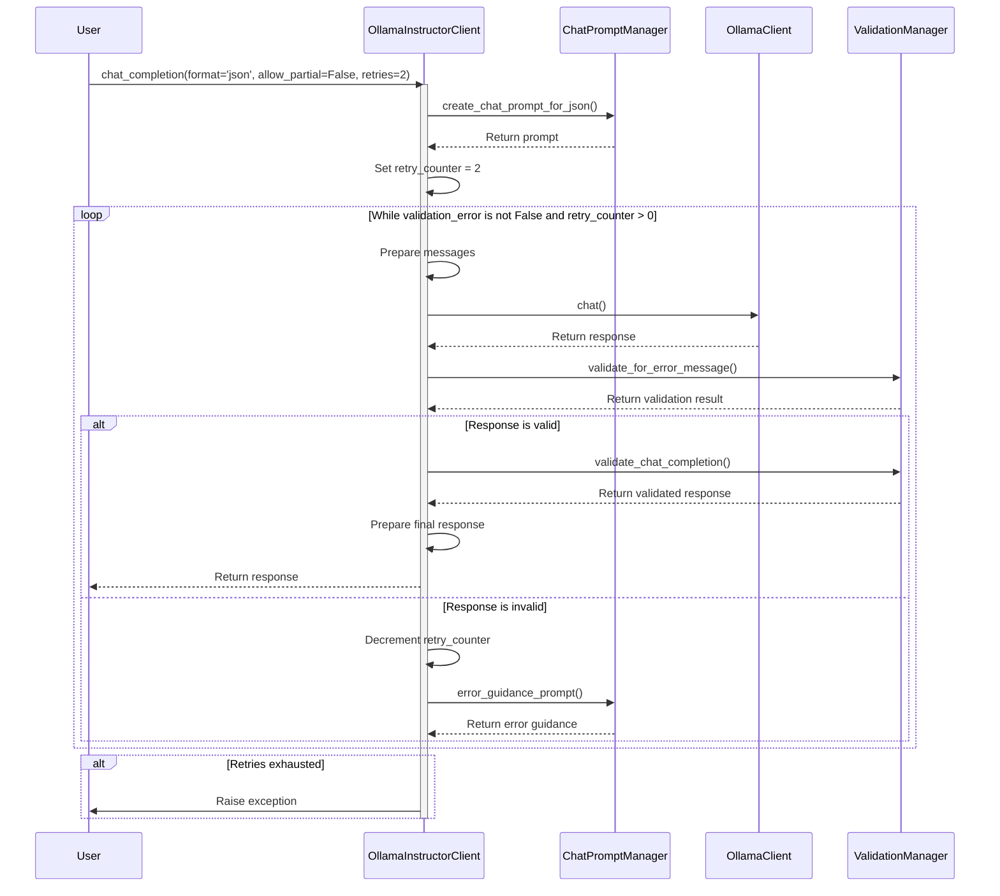

# The concept of ollama-instructor

Interested about the conecept of `ollama-instructor`? Then this section is for you.

## The main stack

`ollama-instructor` uses different Python libraries and combines them in a way that makes ollama-instructor special.

- **Ollama**: Number one of the main libraries of `ollama-instructor` and is the Python client to make API calls to the Ollama server running on your hardware.
- **Pydanctic**: The number two of the main libraries and crucial for specifying JSON schemas, instructing the LLM and validating the responses. More information about the use of Pydantic within `ollama-instructor`can be found here: ['Why ollama-instructor?'](/docs/1_Why%20ollama-instructor.md) + ['Pydantics BaseModel'](/docs/4_Enhanced%20prompting%20within%20Pydantics%20BaseModel.md)

Apart from the main stack you will find other libraries listed in the [requirements](/requirements.txt). However, the core of `ollama-instructor` is formed by Ollama and Pydantic. The other libraries are used for parsing the responses or debugging.

## The flow

`ollama-instructor` has currently two methods for its usage:
- `chat_completion`
- `chat_completion_with_stream` (only with `OllamaInstructorClient`)

The concept for both methods is the same. The differnce between those two is that with `chat_completion_with_stream` you will get a stream of the response. This was more complex to develope since it required to process partial responses during the stream before making the final validation. But it helped for developing the feature `allow_partial`.

To demonstrate the combination and flow of `ollama-instructor` when using one of the above mentioned methods I choosed `chat_completion`. Below you will find a sequence diagram which shows the flow of control and data between different components of the system. It illustrates how the client manages retries, how it interacts with the different classes like ChatPromptManager for creating prompts, how it uses the OllamaClient for API calls, and how it leverages the ValidationManager for response validation. The loop and alternative paths clearly demonstrate the retry mechanism and different outcomes based on the validity of the response.

> Below the diagram you will find a step-by-step explanation of the displayed process.

---

--- 
This diagram illustrates the interactions between different components of the system over time. I recommend opening the code of `ollama-instructor` and looking into it while going through the steps.

1. Initial Call:
   - The sequence begins with the User calling the `chat_completion` method on the `OllamaInstructorClient`.
   - The parameters `format='json'`, `allow_partial=False`, and `retries=2` are passed.

2. Prompt Creation:
   - `OllamaInstructorClient` calls `create_chat_prompt_for_json()` on the `ChatPromptManager`.
   - `ChatPromptManager` returns the created prompt, which includes the system message with instructions for JSON output.

3. Retry Setup:
   - `OllamaInstructorClient` sets the `retry_counter` to 2, as specified in the method call.

4. Main Loop:
   - The diagram shows a loop that continues while `validation_error` is not False and `retry_counter` > 0.

5. Message Preparation:
   - Within the loop, `OllamaInstructorClient` prepares the messages for the API call.

6. API Call:
   - `OllamaInstructorClient` calls the `chat()` method on the `OllamaClient`.
   - `OllamaClient` returns the response from the language model.

7. Initial Validation:
   - `OllamaInstructorClient` calls `validate_for_error_message()` on the `ValidationManager`.
   - `ValidationManager` returns the validation result.

8. Response Handling:
   - The diagram shows an alternative path based on whether the response is valid or not.

9. Valid Response Path:
   - If the response is valid:
     - `OllamaInstructorClient` calls `validate_chat_completion()` on `ValidationManager` for a final validation.
     - `ValidationManager` returns the validated response.
     - `OllamaInstructorClient` prepares the final response.
     - `OllamaInstructorClient` returns the response to the User.

10. Invalid Response Path:
    - If the response is invalid:
      - `OllamaInstructorClient` decrements the `retry_counter`.
      - `OllamaInstructorClient` calls `error_guidance_prompt()` on `ChatPromptManager` to get guidance for the next attempt.
      - `ChatPromptManager` returns the error guidance prompt.
      - The loop continues, going back to the message preparation step.

11. Loop Termination:
    - The loop ends when either a valid response is obtained or the `retry_counter` reaches 0.

12. Final Outcome:
    - After the loop, there's an alternative path:
      - If a valid response was obtained, it's returned to the User (as shown in step 9).
      - If retries are exhausted without a valid response, `OllamaInstructorClient` raises an exception to the User.

13. Method Completion:
    - The activation bar for `OllamaInstructorClient` ends, indicating the completion of the `chat_completion` method.

